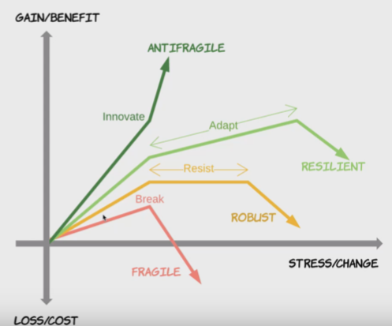
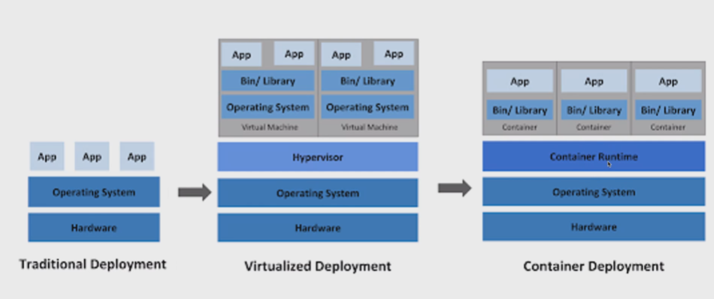
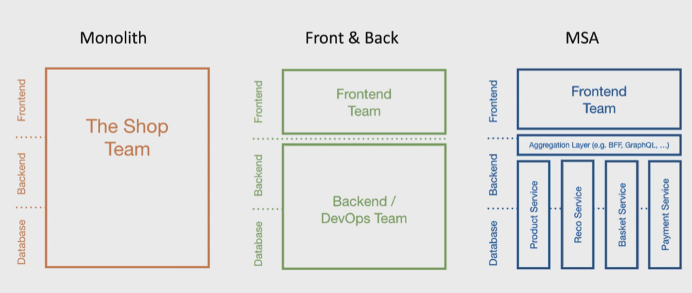

# IT System Histroy

- Fragile, Cowboys
- Robust, Distributed
- Resilient / Anti-Fragile, Cloud Native

  

## Anti-Fragile

- Culture : DevOps
- Architecture : Cloud Native

### 특징

- Auto Scailng : 사용량에 따라 자동으로 늘어나고 줄이는 것
- Microservices : Cloud Architecture의 핵심 / Spring Cloud의 많은 부분이 Netfilx에서 만들어 합류
- Chaos engineering : 시스템이 예측하지 못한 상황이더라도 안정적으로 구축되어야 한다.
- CD : CI/CT/CD/CM/CF를 통한 지속적인 개발이 되어야 한다.
  - CI : 지속적인 통합
  - CD
    - 지속적인 전달 : 서버로 파일 전달
    - 지속적인 배포 : 전달된 파일을 배포

  

## Cloud-Native Architecture

- 확장가능한 아키텍처

  - 시스템의 수평적 확장에 유연
  - 확장된 서버로 시스템의 부하분산, 가용성 보장
  - 시스템/ 서비스 앱 단위의 패키지
  - 모니터링

- 탄력적 아키텍처

  - 서비스 생성/ 통합/ 배포/ 비즈니스 환경변화에 대응시간 단축

    엔터프라이즈 급으로 갈 수록 많은 서비스들이 존재하는데 자동화가 되어있지 않으면 개발시간보다 배포/통합하는데 많은 시간을 소비해야함

  - 분할된 서비스 구조
  - 무상태 통신 프로토콜
  - 서비스 추가와 삭제 자동으로 감지
  - 변경된 서비스 요청에 따라 사용자 요청 처리(동적 처리)

- 장애 격리 (Fault Isolation)

  - 특정 서비스에 오류가 발생해도 다른 서비스에 영향을 주지 않음

- DevOps : Development + Operation 의 합성어로 개발과 운영조직

  더 자주 통합 / 테스트 /개발을 진행

- Container 가상화

  

  Native환경에서 Cloud환경으로 서버를 이전해서 구축하게된 핵심적인 기술

  하드웨어 가상화/서버 가상화에 비해 적은 리소스를 사용하고 가볍고 빠르게 작동할 수 있다.

 

### 구축할때 고려해봐야 할 12가지 ( 12 Factors )

1. Base code : 각 마이크로 서비스에 대한 코드 저장소

   버전을 제어하기 위한 목적으로 형상관리, 배포를 위해 한곳에서 코드를 관리

1. Dependecny Isolation : 각 마이크로 서비스는 자체 종속성을 가지고 패키지되어 있어 전체시스템에 영향을 주지 않은 상태로 변경될 수 있어야 한다.
1. configurations : 하드코딩이 되어있는 것이 아니라 코드 외부에서 구성관리도구를 통해서 마이크로 서비스의 작업을 제어하는 것.
1. linkable backing services : db, cash, messaging, broker와 같은 기능을 별도로 추가로 지원하여 서비스간의 상호가능해야한다.
1. stages of creation : 배포후 실행까지 엄격한 단계가 존재해야 한다. (각각은 고유한 id로 tag를 가지고 있어야 하고, Rollback을 지원해야한다.)
1. statless processes : 다른 마이크로 서비스와 분리되어서 독립적으로 실행될 수 있어야 한다.
1. port binding : 각각의 서비스는 별도의 포트로 바인딩 되어야 한다.
1. concurrency : 하나의 서비스가 서버내에서 여러 컨테이너로 생성되어 실행될 수 있기 때문에 동시성을 지원해야 한다.
1. disposability : 서비스 인스턴스가 삭제가 가능해야하고, 확장성 기회를 높여야 하고 정상적으로 종료를 할 수 있는 상태가 되어야 한다.
1. development & production parity : 개발단계와 프로덕션 단계를 구분할 수 있어야 한다.
1. logs : 마이크로서비스에 의해서 생성된 로그를 이벤트 스트림으로 전달해야 한다.
1. admin processes for eventual processes : 프로세스 관리를 위한 admin기능이 제공되어야 한다.

### 추가 3가지

1. API first : 모든 마이크로 서비스는 API형태가 존재하는 데 이를 가장 먼저 고민하고 개발해야 한다.
1. Telemetry : 모든 지표는 수치화해서 관리할 수있는 항목이어야 한다.
1. Authentication and authorization : API를 사용하는데 있어 인증은 필수로 가져야 한다.

  

## MSA

### Monolith

모든 업무 로직이 하나의 애플리케이션 형태로 패키지 되어 서비스되는 형태

애플리케이션에서 사용하는 데이터가 한곳에 모여 참조되기 때문에 서비스중 일부만 변경되어도 서비스 전체를 새로 패키징과 배포를 거쳐야 하는 단점이 존재한다.

### Micro Service

함께 작동하는 작은 규모의 서비스들

### 어떨때 MS로 해야 할까

서비스와 관해 질문해보기

1. Multiple rate of change : 기존 개발 대비 시간/돈을 얼마나 더 들지와 투자를 할 수 있는가?
1. Independent life cycles : 어플리케이션을 구성하고 있는 서비스들이 독립적으로 잘 구성되어 있는가?
1. independent scalability : 각각의 서비스를 운영하는데 있어서 서비스 유지보수및 확장성이 가능한가? 스케일링이 쉽게 가능한가?
1. isolated failure : 서비스들의 오류들이 독립적이며 최소한의 영향을 미치는가?
1. simplify interactions with external dependencies : 외부종속성과 상호작용이 최소한으로 구분되어있는가?
1. polyglot technology : 여러가지 stroage, 언어들을 사용할 수 있는 기술 (polyglot)을 적용할 수 있는가?

 

### Soa vs MSA

- SOA : 재사용을 통한 비용절감 (서비스 공유 최대화)

  - 공통의 서비스를 ESB에 모아 사업측면에서 공통 서비스 형식으로 서비스 제공

- MSA : 서비스간의 결합도를 낮추어 변화에 능동적으로 대응 (서비스 공유 최소화)
  - 각독립된 서비스가 노출된 REST API 사용
