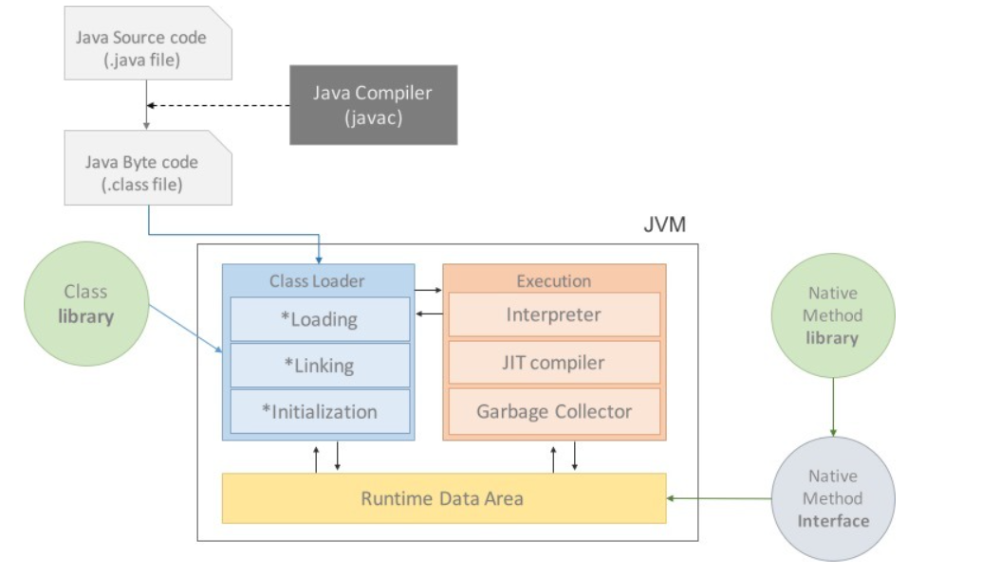
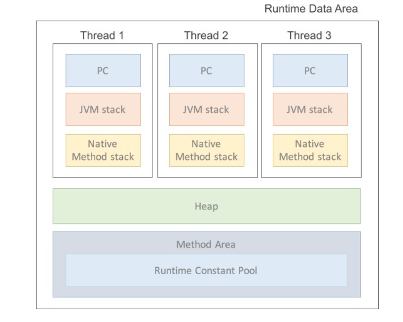

# JVM

Java Virtual Machine의 약자로 Java와 OS사이에서 중개자 역할을 하여 메모리 관리, GC(garbage collection)을 수행하는 스택기반의 가상머신으로 C++,C와 같은 언어들과 다르게 OS에 상관없이 동작이 가능하다.

Java는 C나 C++과 같이 바로 컴파일되는 컴파일 언어가 아니다. 컴파일언어는 컴파일 환경에 따라 다르게 컴파일이 된다는 특징을 가지고 있기 때문에 Java의 가장 큰 특징인 os와 환경에 구애받지 않는 다는 점을 위반하기 때문이다.
(파이썬이나, JS는 인터프리터 언어)

> 컴파일러는 전체 소스코드를 통해 분석하여 오류가있는지 확인하며 재구성하여 기계어로 바꾸는 반면, 인터프리터는 한 행씩 실행하며 분석을하고(중간 코드로 변환) 중간에 에러가 발생시 그 이후의 코드는 확인하지 않는다.

<br>

Java는 환경에 구애받지 않는다는 특징때문에 자바 컴파일러가 자바코드를 바이트 코드(.class파일)로 변환하고 이를 기계어로 번역해주는 과정을 거치는 인터프리터와 컴파일러를 모두 사용하는 언어이다.

> 컴파일러는 기계어로 변환해주는 프로그램인데 기계어가 아닌 바이트코드로 변환해주는 프로그램을 자바 컴파일러라고 부르는 이유는 바이트코드는 기계어로 변환해주는 JVM을 위한 언어이고 JVM도 기계이기 때문에 자바 컴파일러라고 부른다.

<br>

자바 인터프리터느 자바 컴파일러에 의해 변환된 바이트코드를 다른 환경의 JVM에서 실행할 수 있도록 기계어로 변환해주는 역할을 한다.

> 환경에 구애받지 않는다는 인터프리터의 장점을 이용하기 위해 컴파일러로 중간언어로 변환 후 이를 기계어로 변환하는 방식을 이용한다.

<br>

# 컴파일 하는 방법

컴파일 이름 그대로 자바 컴파일러를 이용해 자바코드를 바이트코드(.class파일)로 변환하는 것으로 설치한 jdk의 bin폴더안에 `javac`이라는 자바 컴파일러가 존재하기 때문에 이를 이용하면 된다.

```shell
javac hello.world.java
```

## 컴파일 과정

1. 어휘 분석 : public, class, operator(연산자,괄호등), 리터럴(상수), 등으로 분석하여 나눈것을 `어휘소`라고 하며 이 어휘소들을 하나의 스트림(토큰 스트림)으로 만드는 과정

1. 구문 분석 : 토큰스트림을 통해 문법에 맞는지 확인하고 틀렸다면 `Syntax error`를 띄운다.

1. 의미 분석 : 타입검사나 자동 타입 변환을 수행하여 검사하고 에러를 띄운다.

1. 중간 코드(바이트 코드) 생성

<br>

# 실행방법

대부분은 IDE를 통해 실행하나 CLI의 `java`명령어를 이용하여 실행이가능하다.

default 패키지라면 바로 파일명을 통해 실행이 가능하며 package를 명시하여 실행도 가능하다.

```shell
java hello_world

java java.me.example.hello_world
```

<br>

# 바이트코드란

위에서 설명것 처럼 JVM이라는 기계가 이해할 수 있는 언어이다.

때문에 자바코드를 바이트 코드로 변환하는 것을 `자바 컴파일러`라고 부른다.

<br>

# JVM 구성요소


[사진 출처](https://asfirstalways.tistory.com/158)

- Class Loader : 바이트 코드(.class 파일)를 JVM내로 로딩하고 링크를 통해 배치하는 작업을 수행

  런타임 시에 동적으로 클래스들을 로드하기 때문에 이때 클래스를 처음 참조한다.

  로딩시에 클래스가 존재하지 않는다면 클래스를 찾을 수없다고 에러가 발생한다.

- Execution Engine : 클래스를 실행 시키는 역할로 JVM을 위한 바이트코드를 기계어로 변경하는 작업을 수행

  - Interpreter : 바이트 코드를 명령어 단위로 읽어서 실행하고 한 줄씩 수행하기 때문에 속도가 느리다는 말이 나온다.

  - JIT (Just In Time) : 인터프리터의 단점을 보완하기 위한 컴파일러로 인터프리터 방식으로 실행하다가 적절한 시점에 바이트코드 전체를 컴파일하여 기계어로 바꾸어 실행하는 방식

    기계어는 캐시에 보관하기 때문에 한 번 컴파일된 코드는 빠르게 수행이 가능하나 한 번만 실행되는 코드라면 컴파일하지 않고 인터프리팅하는 것이 유리하기 때문에 JIT컴파일러를 사용하는 JVM들은 내부적으로 메서드의 빈도를 체크하고 정도를 넘었을 경우 수행하는 식으로 스케줄링한다.

  - Garbage Collector : 사용하지 않는 메모리를 체크하고 제거하는 garbage Collection을 수행하는 스레드가 존재한다.

<br>

# Runtime Data Area

JVM내의 메모리


[사진 출처](https://asfirstalways.tistory.com/158)

- PC Register : 스레드가 어떤 부분을 어떤 명령으로 실행할지를 기록하는 부분으로 현재 실행중인 메서드가 네이티브가 아니면 JVM명령어 위치에 저장되고 네이티브이면 저장되는 값은 정의 되지 않고 CPU의 Register와 다르게 연산을 위해 필요한 피연산자를 임시로 저장하기 위한 용도로 사용한다.

  현재 수행중인 JVM 명령의 주소를 갖는다.

- JVM Stack : 매개변수, 지역변수, 리턴 값등 스레드나 메서드의 데이터들을 임시로 저장하는 공간으로 스레드마다 별도의 공간을 갖고있으며, 메서드가 호출될때마다 `프레임`이 생성되어 이곳에 임시 데이터공간으로 사용하고 메서드가 끝나면 프레임은 삭제되며 스레드가 종료시 스택공간도 제거된다.

- Native Method Stack : 바이트 코드가 아닌 기계어로 작성된 프로그램을 실행시키는 공간으로 자바가 아닌 다른언어로 작성된 네이티브 메서드를 지원하기 위해 사용되는 스택이다.

- Heap : 인스턴스화 된 모든 클래스와 배열, 객체를 저장하는 가상 메모리 공간으로 모든 JVM스레드가 공유하는 자원이고 `GC`에 의해서만 자원이 회수가능하다.

  - Permanent Generation : 생성된 객체들의 정보 주소값이 저장된 공간으로 `클래스 로더`에 의해 로드되는 `class`,`Method`등의 메타정보가 저장되는 영역

    Reflection(객체를 통해 클래스의 정보를 분석해내는 프로그램 기법)을 사용하여 동적으로 클래스가 로딩되는 경우에도 사용된다.

  - Young Generation

    - Eden : 객체들이 최초로 생성되는 공간
    - Survivor 0/1 : Eden에서 참조되는 객체들이 저장되는 공간

    대부분의 객체들이 금방 접근 불가 상태가 되기 때문에 많은 객체가 이 영역에 생성되었다가 사라지고 이 영역에서 객체가 사라질때 `Minor GC`가 발생한다고 한다.

  - Old Generation : 접근 불가능 상태로 바뀌지 않고 Young 영역에 남아 있는 객체가 여기로 복사되며, Young 영역보다 크게 할당되고 GC는 적게 발생한다.

    이 영역에서 객체가 사라질 때 `Major GC`가 발생한다고 한다.

    [Garbage Collector의 자세한 내용](https://d2.naver.com/helloworld/1329)

- Method Area : 클래스 정보를 처음 메모리 공간에 올릴때 초기화 대상을 저장하기 위한 메모리 공간으로 `런타임 상수 풀`, `필드와 메서드 데이터`, `생성자`, `메서드의 코드 내용`을 저장한다.
  _(사실상 컴파일 된 바이트코드의 대부분이 메소드 바이트 코드이고 바이트코드에는 런타임 상수풀이 아니라 그냥 상수풀이 포함되어있기 때문에 거의 모든 바이트코드가 올라간다고 봐도 무방하다.)_

  > 런타임 상수풀은 이 상수풀을 바탕으로 런타임(메서드 영역에 저장될때)에 만들어진다.

      - 런타임 상수풀 : 컴파일타임에 이미 알 수 있는 숫자 리터럴 값부터 런타임에 해석되는 메서드와 필드의 참조까지를 포괄하는 여러 종류의 상수가 포함

<br>

# JDK와 JRE 차이

- JDK : Java Development kit의 약자로 `컴파일러`,`역 어셈블러`,`디버거`,`의존관계 분석`등 **개발**에 필요한 도구를 제공

- JRE : Java Runtime Envirmont의 약자로 `Class Loader`, `실행 명령(java)`와 같이 **실행**에 필요한 라이브러리를 제공

- JVM : Java Virtual Machine의 약자로 `인터프리터`, `JIT`등을 이용하여 바이트 코드를 OS에 맞게 기계어로 변경하여 OS에 독립적으로 실행 될 수 있도록 추상화를 제공

<br>

# OracleJDK 와 OpenJDK의 차이

JVM은 `ORACLE`이라는 기업이 JVM의 표준을 정의하면 `Amazon`이나 `Oracle`,`Azul`와 같은 기업들이 표준에 따라 실물을 만들어 제공하게 된다.

이때, 스펙과 표준을 정의한 Oracle이 배포한 JDK가 OracleJDK이며, 가격 정책이 존재한다.

다른 기업들이 무료로 배포한 JDK를 OpenJDK라고 한다.

<br><br><br>

---

## Reference

https://asfirstalways.tistory.com/158
https://m.blog.naver.com/ehcibear314/221228200531
https://catch-me-java.tistory.com/9
https://homoefficio.github.io/2019/01/31/Back-to-the-Essence-Java-%EC%BB%B4%ED%8C%8C%EC%9D%BC%EC%97%90%EC%84%9C-%EC%8B%A4%ED%96%89%EA%B9%8C%EC%A7%80-2/
