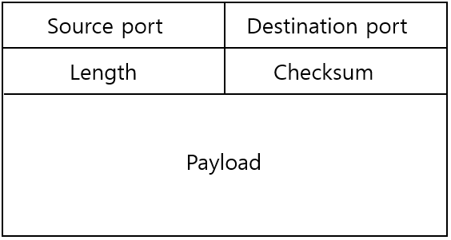
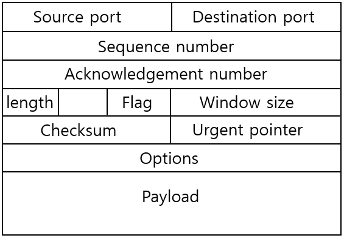

# 전송 계층 ( Transport Layer )

각 호스트의 응용계층 프로세스간 논리적인 통신을 제공하며, 종단에서만 실행된다.
_라우터(패킷 스위치)에서는 실행되지 않는다._

응용계층과 네트워크 계층의 연결을 도와주는 계층.

전송계층의 대표적인 프로토콜로 `TCP` , `UDP`가 있으며 구글에서 13년도에 발표한 `QUIC`등 존재한다.

<br>

### 용어

- `세그먼트` : 패킷단위로 메세지를 나누어 전송하기 위해 전송계층 헤더를 추가한 것. <br>(source/dest 포트번호, 순서번호, 오류검출코드 등)
- `트랜스포트 다중화` : 세그먼트들을 네트워크 계층으로 전달하는 것.

  송신할때 일어나며 전송계층을통해 응용계층의 각 세그먼트들이 네트워크 계층으로 모이는 것.

- `트랜스포트 역다중화` : 전송계층의 세그먼트 데이터들을 올바른 소켓으로 전달하는 것.

  수신과정에서 일어나며 네트워크 계층에서 전송계층을 통해 응용계층으로 퍼지는 것.

<br><br>

## 🔵 UDP

---

### ✔ 특징

- 비연결 지향형

- 비신뢰 기반

- 혼잡제어 x

- 1:N 통신

- 연결설정, 연결 상태 유지가 없다.

- TCP에 비해 작은 패킷의 크기를 갖는다.

- 다중화 역다중화 과정 중에 IP주소는 보지 않는다. (포트번호만 신경쓴다.)

<br>

### ✔ 세그먼트 구조



- source port : 출발지 포트
- dest port : 목적지 포트
- length : 세그먼트 길이
- 체크섬 : 오류검출 코드

  [자세한 설명 보기](./errorDetection-correction.md)

- payload : 실제 데이터

<br><br>

## 🔵 TCP

---

### ✔ 특징

- 연결 지향형
- 1:1 통신
- 신뢰 기반

- 흐름제어
- 혼잡제어

<br>

### ✔ 세그먼트 구조



- source port : 출발지 포트
- dest port : 목적지 포트
- 순서번호 (seq) : 데이터의 세그먼트 별로 부여하는 일련번호로, 패킷들을 구분하기 위한 용도
- 확인응답번호 (ack) : 패킷을 정상적으로 수신했는지 확인하기 위한 번호
- 헤더 길이 : tcp 헤더 시작부터 payload전까지의 길이
- 플래그 변수 : 논리적인 tcp 연결을 제어 / 관리하기 위한 변수

  - `urg` : 긴급 데이터를 알리는 플래그로 긴급 포인터에 값이 채워져있다는 것을 알림..
  - `ack` : 확인응답번호가 유효하다는 것을 알림.
    <br>
    SYN 세그먼트 전송 이후 (연결 시작 이후) 모든 세그먼트는 1로 세팅
  - `psh` : 버퍼링된 데이터를 가능한 빨리 응용프로그램으로 전달.
    <br>
    서버측에서 더이상 전송할 데이터가 없음을 나타내기도 한다.
  - `rst` : 강제로 연결을 초기화 하기 위한 용도
  - `syn` : 연결 설정을 초기화 하기 위한 용도  
    연결을 시작할때 세팅한다.
  - `fin` : 연결해제를 위한 용도

- 수신측 윈도우 (rwnd) : 수신자가 받을 수 있는 세그먼트의 크기
- 체크섬 : 오류 검출 코드
- 긴급 포인터 : 긴급 데이터를 가르키는 포인터
- 옵션 : MSS크기 등 데이터 전송을 위한 협약을 연결단계에서 설정
- payload : 실제 데이터

<br>

### 신뢰적인 데이터 전송

재전송 기반 에러제어 (= 검출 후 재전송 방식, ARQ )

<br>

- 정지 대기 방식 ( stop and wait )

  송신자는 1개의 패킷을 보내고 기다렸다 다음 패킷을 받는 것

  <br>

  도입된 Version 순서

  - rdt 1.0 : 송신과 오류가 없는 경우 문제 없이 동작
    <br>문제점 : 비트 오류의 경우가 존재한다.
  - rdt 2.0 : 체크섬을 통해 비트 오류 검출 , ACK/NAK 이용하여 재전송
    <br>문제점 : ACK/NAK 비트 오류의 경우 존재, 중복 패킷 발생

  - rdt 2.1 : ACK/NAK의 체크섬, 순서번호(seq) 도입
    <br>문제점 : ACK/NAK를 잘 수신했는지 송신측은 알지 못하는 문제 발생

  - rdt 2.2 : ACK만 사용하며, (0,1)만 사용하는 이진 ACK사용
    <br>문제점 : ACK 손실 위험

  - rdt 3.0 : timer 사용하여 재전송
    <br>문제점 : 한개의 패킷씩 송수신 하니 시간이 오래 걸림

- 파이프라이닝 기법 (슬라이딩 윈도우 기법)

  정지 후 대기방식은 버퍼링이 심하기 때문에 한번에 보낼 수 있는 패킷의 범위인 `순서범위`가 커져야 한다.

  - GBN ( Go-Back N) : 슬라이딩 윈도우 프로토콜로 윈도우 크기만큼 패킷을 보내고 중간에 손실이 발생시 수신자는 `누적 ACK (정상적으로 받은 ACK값 중 가장 큰 값)`이후 모든 요청에 대한 응답으로 누적 ACK를 반복 재전송하며, 이후 요청은 모두 버리는 방법.
    <br>
    <br>
    단점 : 밴드폭 지연이 클때, 많은 패킷이 파이프라인에 있을 수 있어 불필요한 재전송으로 악순환에 빠져 성능 하락할 수 있다.

  - SR (Selective Repeat, 선택적 반복) : 손실된 이후의 요청은 buffer에 쌓아두고 손실된 패킷의 재요청이 들어왔을때, 일괄 전송 하는 방법.
    <br><br>
    단점 : 순서번호 크기가 작고 윈도우 크기가 크면 수신자는 어떤 패킷인지 헷갈리게 된다. ( 따라서, 윈도우 크기 <= 순서번호 / 2로 설정해야한다.)

- 빠른 재전송 : 송신자느 중복 ACK를 3회 수신시 timer를 기다리지 않고 재전송

<br>

실제로 TCP는 한가지 방법만 쓰는 것이 아닌 위의 모든 방법의 혼합으로 신뢰적인 데이터 전송을 한다. ( 기본 뼈대는 stop&wait, 빠른 재전송 이용하며 순서범위를 키운 슬라이딩 윈도우 기법에서도 이전 요청은 buffer에 쌓아두고 누적 ACK 전송 하는 방식으로 GBN과 SR의 혼합방법 )

`TCP MTU` : IP기반의 정보로 IP헤더,TCP헤더,paylod를 모두 포함하는 길이 (보통 1500byte)

`TCP MSS` : 실제 payload가 담을 수 있는 크기 (보통 1460 byte) => IP헤더,TCP헤더 각각 20byte씩 (TCP 연결단계에서 설정)

<br>

### 적정 timer 값 구하는 방법

- timer가 RTT보다 작게 되면 잦은 타임아웃과 재전송 발생

- timer가 RTT보다 크게 되면 세그먼트 손실대응 지연

<br>

매 패킷 송수신마다 Time interval를 계산한다. (매 전송마다의 RTT값을 기준으로 계산하여 정한다.)

```
EstimatedRTT + 4*DevRTT
```

- EstimatedRTT = (1-α)EstimatedRTT + αSampleRTT
  <br>여기서 SampleRTT가 이번에 송수신한 패킷의 RTT값이고 EstimatedRTT는 이전의 계산한 값으로 한마디로 `이전의 샘플값 + 새로 측정한 샘플값` 이다.
  <br>여기서 α는 보통 0.125로 계산한다.

- DevRtt = (1-β)DevRTT + β(SampleRTT - EstimatedRTT)
  <br>한마디로 `새로 측정한 값 - 이전의 샘플값`이다.

이러한 공식에 의해 timer값이 매번 계산된다는 것만 알아 두자!

<br>

### 흐름 제어

수신자는 송신자를 제어하여 수신자 버퍼의 여유공간 이상으로 데이터 전송을 과도하게 못하게 막는 것.

이때 `수신자 버퍼`는 사용자 프로세스 (사용자가 처리하는 속도)와 컴퓨터의 연산 속도의 과도한 괴리로 발생하는 지연을 막고자 캐시역할을 수행하는 공간이다.

TCP 헤더 안에 수신 윈도우(rwnd)영역을 이용해 수신자 버퍼의 여유공간의 크기를 알린다.

=> 송신자는 수신자가 rwnd이하로 송신을 제한하여 오버플로우를 방지 하는 것.

<br>

### 연결 관리

TCP는 연결지향형 프로토콜로 연결과 종료에 단계가 존재한다.

- 연결 단계 (3-way-handshake)

  1. 송신자는 SYN세그먼트 송신 : SYN비트와 순서번호(seq)만을 담은 세그먼트를 IP데이터 그램에 캡휼화하여 전송한다.

  2. 수신자는 ESTABLISHED상태가 되며 SYNACK 세그먼트를 전송한다. (SYN, ACK 비트 설정, ACK Num = 받은 seq+1, seq설정)

  3. 송신자는 SYNACK 세그먼트를 수신 후 자원을 할당(ESTABLISHED) 후 ACK 세그먼트를 보낸다. (SYN은 0, ACK Num = 받은 seq+1, seq = 나의 이전 seq + 1)

- 종료 단계 (4-way-handshake)

  1. FIN 비트 1로 설정 후 송신 (송신자는 FIN-WAIT 상태 = ACK를 기다림 ), 수신자는 ACK 세그먼트와 ACK Num = 받은 seq + 1로 설정 후 송신

  1. 송신자는 ACK를 받고 FIN-WAIT2상태 (FIN 을 기다림)

  1. 수신자는 FIN 세그먼트를 송신 (수신자는 4번의 ACK를 받고 종료 )

  1. 송신자는 FIN 세그먼트를 수신하면 ACK세그먼트를 보내고 TIME-WAIT후 종료
     <br> => 통신링크에 남은 데이터가 있을 수 있기 때문에 wait후 종료

  <br>

### 혼잡 제어

네트워크가 처리못할 수준으로 여러곳에서 많은 데이터를 전송하게 되면 통신링크가 혼잡상태가 되어 잦은 재전송으로 인해 악순환으로 패킷들이 링크에 계속 쌓여 상황을 더욱더 악화시키되므로 이를 방지하고 제어하는 것

- 종단간의 혼잡 제어 : TCP는 윈도우크기를 줄이거나, TTL값을 혼잡 증가로 나타내는 것으로 사용하는 방법으로 제어.

- 네트워크 지원 혼잡제어 (명시적 혼잡 표시) : IP 데이터그램 헤더의 TOS의 두비트가 ECN으로 사용된다.
  <br>ECN혼잡 표시는 지속적 혼잡일시 이를 수신하면 송신호스트에게 TCP ECE 비트를 세팅하여 혼잡 표시를 알리고 후에 CWR 비트를 세팅하여 알린다.

  - 직접적인 피드백 : 네트워크에서 초크 패킷을 이용하여 직접 전송 ( 혼잡한것을 알리는 것 )

  - 수신자 경유하는 네트워크 피드백: 패킷안의 특정 필드에 표시하여 다시 알리는 것 ( TTL만큼의 시간이 소요된다. )

<br>

종단간의 혼잡 제어에서 윈도우 크기는 min(rwnd, cwnd)를 사용하며, rwnd는 사용자가 빨리 처리하지 않으면 느리게 줄기 때문에 cwnd를 줄여 제어를 하게 된다.

`cwnd` : 혼잡 윈도우로 혼잡 제어를 하기 위해 전송할 수 있는 비율을 제한하는 추가적인 변수 값이다.
<br>TCP세그먼트에는 들어가지 않으며, 호스트 컴퓨터에서 결정한다.

`self-clocking` : tcp는 ACK를 주고받는 속도로 cwnd를 증가시키는 trigger(clock)로 사용하기 때문에 self-clocking이라고도 불린다.

<br>

#### 혼잡제어 알고리즘

cwnd크기는 1MSS로 시작

- AIMD : 가법적 증가(AI) + 승법적 감소(MD)

  - 가법적 증가 : 손실감지까지 cwnd 1씩 증가
  - 승법적 감소 : 손실감지시 cwnd 반으로 감소

- slow start : 손실감지까지 2배로 cwnd값을 증가 후 손실감지시 1로 시작하고 ssthresh(slow start threshold)를 cwnd/2로 설정
  <br>

- 혼잡 회피 :
  - 빠른 회복 : 빠른 재전송시 잃어버린 세그먼트(ssthresh)부터 1씩 증가

<br>

### tcp 종류

- Tahoe : slow start로 시작하여 ssthresh 도달시 AIMD로 동작 후 손실 발생시 1부터 다시 시작 ( 손실발생시 ssthresh 설정 )

- Reno : slow start로 시작하여 ssthresh 도달시 AIMD로 동작 후 손실발생시 빠른 회복으로 동작

<br>

### TCP는 위와 같은 방법들로 신뢰적인 데이터 전송, 연결관리, 흐름제어, 혼잡제어를 제공한다.
