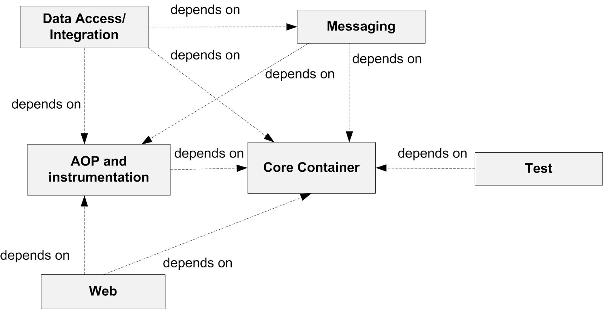
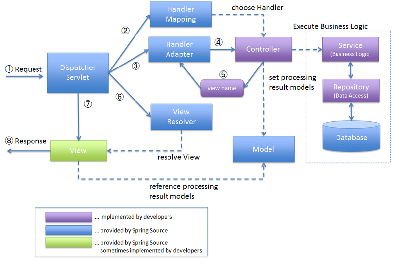

# Spring Framework

자바 플랫폼을 위한 오픈소스 애플리케이션 프레임워크로써 MVC모듈을 제공하여 웹을 효과적으로 개발하기 위한 다양한 서비스를 제공한다.

개발에 필요한 모든 기술을 제공하고 처리를 전담하여 개발자는 비즈니스 로직 개발 업무에 집중 할 수 있게 설계된 프레임워크

<br>

## 장점

- 단순화 된 단위 테스트
- 복잡한 코드의 감소
- 아키텍처의 유연성

<br>

## 특징

1.  크기와 부하 측면에서 경량화 ( 경량 컨테이너 )

1.  제어 역행 (IoC, Inversion of Control)

    - 결합도를 느슨하게 하기 위함
    - `control`의 제어권이 사용자가 아닌 프레임워크에 있다.

1.  의존성 주입 (DI, Dependency Injection)

    - 각각의 계층이나 서비스들 간의 의존성이 존재할 경우 프레임워크가 연결시켜준다.

    - 방법

      - 필드 주입 : 가장 간단한 방법으로 사용하려고 하는 클래스에 선언 후 `@Autowired`키워드를 붙여주면 자동으로 주입이된다.

        - 문제점 :

          1. 단일 책임의 원칙 위반
          1. 불변성 : final을 선언할 수없어 객체가 변할 수 있다.

      - setter 주입 : setter기능의 메서드에 @Autowired를 붙여 구현하는 방식

        - 문제점 :
          1. 불변성 : 이 방법또한 객체가 변할 수 있는 문제가 있다.

      - 생성자 주입 : 조립 시접에 주입

        의존성 주입시 생성자를 인자로 넘기는 방식

        spring4.3이후부터는 @Autowired생략 가능

        final을 붙여 불변성 문제도 해결가능하다.

1.  관점지향 프로그래밍 (AOP, Aspect-Oriented Programing)

    - 트랜잭션이나, 로깅, 보안같은 여러 모듈에서 공통적으로 사용하는 기능의 경우 해당 기능을 분리하여 관리.
      <br>이처럼 모든 모듈에서 적용되어야 하는 기능들을 횡단 관심(공통 관심사항,cross-cutting concerns)라고 한다.

      ex) 모든 메소드의 실행 시간을 측정하고싶어! 할때, 모든 메소드에 코드를 집어넣기엔 유지 보수가 힘들고 공통 로직을 구현이 힘들때 사용
      `@Around("execution(* 패키지 명..*(..))")`과 같이 관심 파일들 적용
      `SpringConfig`에 `@Bean`으로 AOP파일 등록해서 사용 가능

      controller가 해당 service를 실행시 프록시(가짜 스프링빈)을 만들어 AOP를 실행후 joinPoint.proceed()를 호출하여 실제 service를 호출. controller는 proxy와 작용하는 셈

1.  애플리케이션 객체의 생명주기와 설정을 관리한다는 점에서 일종의 컨테이너

1.  PSA(Portable Service Abstraction)
    - 다른 여러 모듈을 사용함에 있어서 별도의 추상화 레이어를 제공

<br>

## MVC 패턴

- Model : 비지니스 로직 처리를 하는 역할

  - DTO : Data Transfer Object로 데이터를 처리하기 위해 객체로 전환하는 setter와 데이터를 읽기위한 getter로 구성. front의 데이터가 처음저장 되는 Object로 유효성 검사또한 수행한다.

  - DAO : Data Access Object : 데이터 접근을 처리하는 객체로 DB에 접근하는 오브젝트.

  - VO : DTO와 동일한 개념이나 읽기 권한만 갖는다.

- Controller : 데이터를 전달한 Mapping 정보가 저장되는 클래스.
  <br>어떻게 처리 할지 알려주는 역할로 일종의 Model과 View의 Proxy역할

- View : 클라이언트와 상호작용하며 데이터를 입력받거나 처리된 데이터를 사용자에게 보여주는 부분

## 모듈


- Core Container : 스프링 프레임워크의 기본 모듈
  - Beans : 스프링 Ioc컨테이너에 의해 관리되며 애플리케이션의 핵심을 이루는 객체들. 의존성 주입 재공
  - Core : 스프링 모듈이 사용하는 유틸
  - Context : 빈 팩토리를 상속하는 애플리케이션 콘텍스트를 구현하고, 리소스 로드 및 국제화 지원
  - SpEL : EL(JSP표현 언어)를 확장하고 빈 속성 접근 처리를 위한 언어 제공
- AOP / Instrumentation : AOP 및 class Instrumentation을 지원하는 모듈

- Messaging : 스프링 MVC 어노테이션처럼 메세지를 메소드에 맵핑시키는 어노테이션의 세트

- Data Access / Integration : DB 및 메시징 공급자와의 상호작용을 간소화하는 모듈

  - JDBC : 여러곳에서 사용되는 상용구 코드를 방지하기 위해 추상화
  - ORM : ORM, JPA, HIBERNATE등 제공
  - OXM : XML매핑 통합 객체 제공
  - Transactions : POJO 및 다른 클래스에 대한 선언적 트랜개션 관리를 제공
    <br> _(POJO는 사용자가 만들어낸 객체로서, 이또한 스프링이 라이프사이클 관리를 위임해서 수행)_

- Web : 웹 밑 포틀릿 앱 개발을 간소화하는 모듈

- Test : 단위 및 통합 테스트 생성을 간소화하는 모듈

<br>

## 모듈간 의존성



<br>

## Spring MVC 전체적인 동작 순서



1. 요청이 들어오면 DispatcherServlet이 web.xml에 등록된 내용만 요청을 가로챈다.

   - 요청이들어오면 doService()실행 -> doDispatch()호출 doDisapatch에게 위임 (모든 요청을 각각의 알맞은 Handler에게 전달하는 역할)

1. 가로챈 요청을 HandlerMapping에게 보내 요청을 처리할 Controller를 찾는다.

   - doDispatch에서 HandlerMapping을 통해 요청에 맞는 HandlerMethod를 찾는다.

1. 찾은 Controller정보를 HanlderAdapter에게 넘긴다.

1. 찾은 컨트롤러(@RequestMapping)에게 가서 로직 처리를 전달한다.

   - handlerMethod 실행

1. 로직 처리 (Controller -> Service -> DAO -> DB -> DAO -> Service -> Controller) 후 보여줄 view정보와 데이터를 넘긴다.

   - handlerMethod에서 RetrunValueHanler에 의해 handleReturnValue()를 호출하여 handlerMethod의 실행결과값을 적절한 Response를 생성

1. DispathcerServlet은 ViewResolver에게 view정보를 넘기면 ViewResolver가 view를 찾는다.

1. 찾은 view에게 찾은 데이터를 보내 완성한 page(render)를 DispatcherServlet이 클라이언트에게 최종적으로 보낸다.

<br>

## 파일 구조 (Maven)

```
project
    └ src/main/java
    │   └패키지명
    │       └contoller.java
    └ src/main/resources
    │   └META-INF
    │   └log4j.xml
    └ src/test/java
    └ src/test/resources
    └ JRE System Library
    └ Maven Dependencies
    └ src
    │   └main
    │       └webapp
    │           └resouces
    │           └WEB-INF
    │               └classes
    │               └spring
    │               │   └appServlet
    │               │   │   └servlet-context.xml
    │               │   └root-context.xml
    │               └views
    │               │   └home.jsp
    │               └web.xml
    └ target
    └ pom.xml
```

- src/main/java : java파일. 스프링 구조에 맞춰 클래스 파일들 작성

- src/main/resources : 자바 클래스에서 사용하는 리소스들. DB연결을 위한 파일, 의존성 주입을 위한 xml등 모든 파일

- src/test/java : 테스트를 위한 자바 코드

- src/test/resources : 테스트를 위한 리소스 파일들

- Maven Dependencies : Maven에서 자동으로 관리해주는 라이브러리들. <br>pom.xml에 작성된 라이브러리들을 자동으로 다운, 관리

- src : Web에 관련된 데이터들이 있는 루트 폴더

  - main/webapp/resources : 웹에 필요한 데이터들<br>css,js,img와 같이 클라이언트가 직접 접근할 수 있는 공간. (controller가 요청을 가로채지않고 바로 접근할 수 있도록 설정하여 사용하는 곳.)

  - main/webapp/WEB-INF : 웹에 필요한 코드파일과 컴파일된 파일, 환경설정 파일들<br> 컨트롤러를 통해서만 접근 가능
    - classes : 컴파일된 파일 보관
    - spring : 스프링 환경설정 파일(context) 보관
    - views : jsp, html파일 보관 <br>이 폴더가 `'/'`의 기준점
    - web.xml : 웹 설정 파일

- pom.xml : Maven 설정 파일

<br>

## web.xml

WAS가 최초 구동될때 웹 애플리케이션 설정을 위한 파일

- \<servlet> : DipatcherServlet을 구현하기 위해 사용할 클래스와 초기 파라미터 정보 포함

- \<servlet-name> : 이 이름을 가지고 다른 설정파일에서 서블릿 정보 참조

- \<servlet-class> : 어떤 클래스를 사용할지 명시

- \<init-param> : 초기 파라미터 정보로써 기술하지 않으면 스프링이 자동적으로 appServlet-context.xml을 이용하여 스프링 컨테이너 생성

- \<laod-on-startup> : 서블릿이 로딩될때 로딩 순서를 결정하는 값
- \<servlet-mapping> : \<url-pattern>의 패턴으로 요청이 들어오면 해당 servlet에게 요청을 전달하는 정보 기술

<br>

## servelet-context.xml

서블릿 관련 설정 파일로 `prefix`와 `suffix`를 붙여주는 역할을 해 일일이 전체경로와 파일확장자를 붙이지 않아도 되도록 해준다.

스프링에서 사용하는 bean을 일일이 선언하지 않고도 어노테이션을 자동적으로 인식하게 하는 역할

- \<annotation-driven> : @Controller 어노테이션을 감지하여 Controller로 등록

- \<resources> : 정적인 웹 리소스들의 정보를 기술
- \<beans:bean class="org.springframework.web.servlet.view.InternalResourceBiewResolver"> : Controller가 Model을 리턴하고 DisaptcherServelt이 jsp파일을 찾을때 쓰이는 정보를 기술
- \<context:component-scan> : @Component로 등록된 Bean객체를 찾게 도와주는 역할

<br>

## Controller 파일

로직 처리를 담당하는 파일

- @Controller : 해당 클래스를 controller로 인식하게 해주는 어노테이션

- @RequestMapping : HandlerAdapter가 실행할 메서드를 결정하는데 필요한 정보를 제공하는 어노테이션으로 `method`와 `url`으로 메서드 결정.

- 실행 함수 : return은 문자열로 servlet-context.xml의 설정을 참조하여 view파일에 대한 정보를 제공.

<br>

## [maven과 gradle 차이](https://hyojun123.github.io/2019/04/18/gradleAndMaven/)

<br>

## api

@ResponseBody 어노테이션 : HTTP BODY에 직접반환.<br> 템플릿엔진이 아닌 바로 데이터를 전송하라는 어노테이션. viewResolver가 아닌 HttpMessageConverter가 동작하며, String이면 StringConverter가 객체이면 JsonConverter가 동작하여 default는 객체를 json형식으로만들어서 응답.

클라이언트의 HTTP Accept헤더와 서버의 컨트롤러 반환 타입 정보 둘을 조합하여 반환방식 자동으로 결정

### 도메인 : 소프트웨어를 개발하는 대상 영역. 개발대상과 범위

<br><br>

---

## Reference

위키 백과 - https://ko.wikipedia.org/wiki/%EC%8A%A4%ED%94%84%EB%A7%81_%ED%94%84%EB%A0%88%EC%9E%84%EC%9B%8C%ED%81%AC

crosscutting concerns - https://winmargo.tistory.com/89

특징 설명 - https://opentutorials.org/course/2428/13594

spring mvc 동작 순서 - https://devpad.tistory.com/24

DispatcherServlet 동작원리 - https://galid1.tistory.com/526
