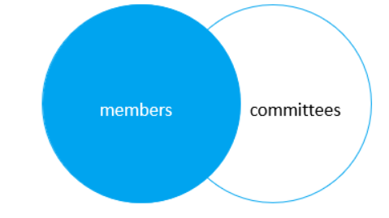
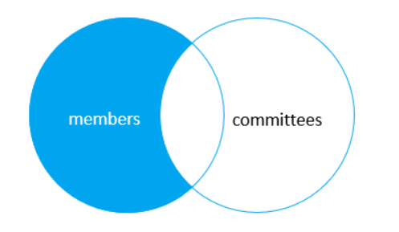
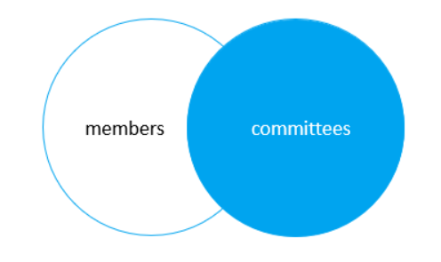
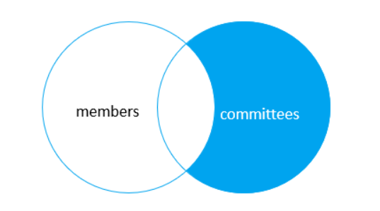

# JOIN

한 테이블과 다른 테이블이 `외래 키`로 연결이 되어 있는 경우 두 테이블을 연결하여, 두 테이블에서 원하는 데이터를 `SELECT`가 가능하다.

<BR>

## INNER JOIN

두 테이블을 비교하여 조건이 참인 COLUMN을 SELECT

두 테이블 간의 값이 일치하는 행만 포함 ( 교집합 )

```SQL
SELECT column_list
FROM table_1
INNER JOIN table_2 ON join_condition;
```

join_condition이 참인 COLUMN을 SELECT하는 경우이다.

```SQL
SELECT
    m.member_id,
    m.name member,
    c.committee_id,
    c.name committee
FROM
    members m
INNER JOIN committees c
	ON c.name = m.name;
//INNER JOIN committees c
//    USING(name);
```

두 테이블에 colmun_name이 같아 `table_1.name = table_2.name` 인 경우 `USING`을 사용하여 표현 할 수 있다.

<br>

## LEFT JOIN

왼쪽 테이블을 기준으로 모든 값을 가져오되, 오른쪽과 같은 값은 값을 채워서 가져오고 오른쪽과 같지 않은 값은 NULL로 select한다

```sql
SELECT
    m.member_id,
    m.name member,
    c.committee_id,
    c.name committee
FROM
    members m
LEFT JOIN committees c USING(name);
```



```sql
SELECT
    m.member_id,
    m.name member,
    c.committee_id,
    c.name committee
FROM
    members m
LEFT JOIN committees c USING(name)
WHERE c.committee_id IS NULL;
```

where에 `is null`을 추가하여 왼쪽테이블에서 교집합을 뺀 값을 select할 수 있다.


<br>

## RIGHT JOIN

left join의 반대로 오른쪽 테이블을 기준으로 모든 값을 가져오되, 조건이 참이 아닌 값은 null로 가져온다.

```sql
SELECT
    m.member_id,
    m.name member,
    c.committee_id,
    c.name committee
FROM
    members m
RIGHT JOIN committees c on c.name = m.name;
```



```sql
SELECT
    m.member_id,
    m.name member,
    c.committee_id,
    c.name committee
FROM
    members m
RIGHT JOIN committees c USING(name)
WHERE c.committee_id IS NULL;
```

where에 `is null`을 추가하여 오른쪽테이블에서 교집합을 뺀 값을 select할 수 있다.


<br>

## JOIN ON에서 조건 추가와 WHERE 조건 비교

```SQL
SELECT
    o.orderNumber,
    customerNumber,
    productCode
FROM
    orders o
LEFT JOIN orderDetails
    USING (orderNumber)
WHERE
    orderNumber = 10123;
```

```SQL
SELECT
    o.orderNumber,
    customerNumber,
    productCode
FROM
    orders o
LEFT JOIN orderDetails d
    ON o.orderNumber = d.orderNumber AND
       o.orderNumber = 10123;
```

위의 두 쿼리 문을 비교해보면, 첫번째 쿼리문은 ordernumber이 같은 column만 select후 where절로 인해 ordernumber이 10123인 column만 select한다.

두번째 쿼리문은, 모든 ordernumber이 같은 column에 대해 ordernumber이 10123인 column만 값이 들어있고 다른 모든 column은 null값이 들어있는 테이블을 모두 select하는 쿼리문이다.

<br>

## CROSS JOIN

크로스 조인은 on 조건 없고, 모든 테이블의 행을 결합한다. (행렬의 곱, mxn)

```sql
SELECT
    m.member_id,
    m.name member,
    c.committee_id,
    c.name committee
FROM
    members m
CROSS JOIN committees c;
```

<br>

## SELF JOIN

한 테이블에서 자기 자신을 참조하여 한 column과 다른 column을 비교할 때 사용한다.

SELF JOIN도 INNER JOIN과 LEFT JOIN을 이용하여 교집합만 표시할지, NULL값을 포함한 값을 가져 올지 상황에따라 선택하여 사용하면된다.

- INNER JOIN

  ```SQL
  SELECT
  CONCAT(m.lastName, ', ', m.firstName) AS 'Manager',
  CONCAT(e.lastName, ', ', e.firstName) AS 'Direct report'
  FROM
      employees e
  INNER JOIN employees m ON
      m.employeeNumber = e.reportsTo
  ORDER BY
      Manager;
  ```

- LEFT JOIN

  ```SQL
  SELECT
  CONCAT(m.lastname, ', ', m.firstname) AS 'Manager',
  CONCAT(e.lastname, ', ', e.firstname) AS 'Direct report'
  FROM
      employees e
  LEFT JOIN employees m ON
      m.employeeNumber = e.reportsto
  ORDER BY
      manager DESC;
  ```
