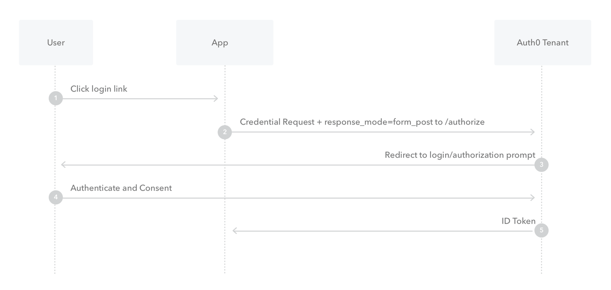

# OAuth

다른 웹사이트의 사용자 정보(아이디)를 이용하여 다른 웹의 접근 권한을 부여하는 방법으로 `공개 표준`이다.

> 기술 표준 문서가 공개 되어 있어 사용이 자유롭고 상황에 따라 다른 정의가 존재 가능하다.

`인증`이 아닌 `인가` 프로토콜

 

## OAuth 1.0

### 관련 용어

- user : 계정을 가지고 있는 개개인

- consumer : OAuth를 이용하여 service provider에 접근하는 웹앱
- service provider : OAuth접근을 지원하는 웹앱
- consumer secret : 서비스 제공자가 consumer를 구분하고 인증하기 위한 key
- request token : consumer가 user에게 접근권한을 인증받기 위한 정보로 access token으로 변환
- access token : 인증 후에 consumer가 user 정보에 접근하기 위한 key

 

### 과정

사진 출처 : https://oauth.net/core/diagram.png

1. 소비자가 서비스 제공자에게 요청 토큰 요청
1. 서비스 제공자가 요청토큰 발급
1. 요청토큰을 가지고 사용자를 서비스제공자로 이동 (Redirect)(서비스 제공자가 사용자 인증 수행)
1. 서비스 제공자가 사용자를 소비자로 이동
1. 소비자가 접근 토큰 요청
1. 인증이 완료 되었다면 서비스제공자가 소비자에게 접근 토큰 제공
1. 소비자는 발급된 접근 토큰으로 사용자 정보 접근

###

 

## OAuth 2.0

기존의 OAuth1은 웹앱이 아닌 앱에서는 사용하기 곤란하고 절차가 복잡해 구현하기가 까다롭고 절차가 복잡해 Service Prvider에게 부담이 된다는 단점을 개선하여 나온 버전으로 버전1과 호환성이 없다.

### 특징

- 웹앱이 아닌 앱 지원 강화
- 암호화가 필요없다 (Https 사용)
- Siganture단순화 정렬과 url인코딩이 필요없다.

### 승인 방식 종류

- Authorization Code Grant Type : 권한 부여 코드 승인 타입

  클라이언트가 다른 사용자 대신 특정 리소스에 접근을 요청할 때 사용된다.

  리스소 접근을 위한 사용자 명과 비밀번호, 권한 서버에 요청해서 받은 권한 코드를 함께 활용하여 리소스에 대한 엑세스 토큰을 받는 방식입니다.

  과정

  

  1. 클라이언트가 파라미터로 `클라이언트 id`, `리다이렉트 url`, `응답 타입으로 code, scope, state`지정하여 권한 서버에 전달 (이때 응답타입은 code,token이 가능)
  1. 리다이렉트 사이트에 사용자의 로그인
  1. 로그인 성공시 권한 부여코드를 권한 서버로부터 받으면 그 코드를 사용하여 access token권한을 권한 서버에 추가로 요청 (client id, client_secret,redirect url, grant_type,code 파라미터로 전송)
  1. 받은 access token을 사용하여 리소스 서버에 접근

- Implicit Grant Type : 암시적 승인

  권한 부여 코드 승인 타입과 다르게 권한 코드 교환 단계 없이 엑세스 토큰을 즉시 반환받아 이를 인증에 이용하는 방식.

  과정

  

  1. 클라이언트가 파라미터로 `클라이언트 id`, `리다이렉트 url`, `응답 타입으로 token, scope, state`지정하여 서버에 전달 (이때 응답타입은 code,token이 가능)
  1. 사용자의 로그인
  1. 로그인 성공후 권한 서버로부터 Access Token을 받고 다시 검증 요청 (url의 `?`와 같은 쿼리문이 아닌`#`뒤에 토큰 값이 반환됨으로써, 서버는 url의 값에 접근할 수 있도록 보장하지만 브라우저는 http요청의 access token을 다시 서버로는 보내지 않고 accessToken의 수명도 표시함으로써 매우 짧은 시간으로 설정)
  1. 요청 받은 검증에 대한 응답
  1. Access Token을 가지고 리소스 서버에 접근

  Access Token이 암시적 획득이기 때문에 /auth/token으로 요청 보낼 피료가 없고 refresh token을 발급하지 않는다.

  SPA의 앱이 중간 코드 교환 단계없이 Access Token을 가져오는 방법으로 원래 JS 앱에서 사용하기 위해 만들어졌다.

- Resource Owner Password Credentials Grant Type : 리소스 소유자 암호 자격 증명 타입

  클라이언트가 암호를 사용하여 엑세스 토큰에 대한 사용자의 자격 증명을 교환하는 때입니다.

  과정

  1. 사용자는 클라이언트에게 id,password를 통해 자격 증명
  1. 받은 password를 기반으로 권한 서버에게 Access Token 정보 요청
  1. Access Token 정보를 받고 (Refresh Token도 받을 수 있다.) 이를 통해 리소스 서버 접근

  직접적인 password를 가지고 1홉만에 이루어지는 타입으로 서드파티가 아닌 앱 소유의 인증서비스를 구현할때 사용

  요청 매개변수

  - grant_type
  - username
  - password
  - client_id
  - client_secret
  - scope

- Client Credentials Grant Type : 클라이언트 자격 증명 타입

  클라이언트가 컨텍스트 외부에서 액세스 토큰을 얻어 특정 리소스에 접근을 요청할 때 사용하는 방식입니다.

  과정

  1. 사용자는 권한 서버에게 바로 Access Token 정보 요청 (client_id, client_secret)
  1. Access Token 정보 응답
  1. 사용자는 Access Token을 가지고 resource 서버 접근

  사용자는 어떤 권한 인증을 하지 않기 때문에 refresh token을 넘겨 주지 않고 client가 권한 위임을 받아 리소스에 직접 접근

  백엔드에서 실행되는 CLI, 데몬 같은 서비스 (M2M 앱)에서는 시스템이 사용자가 아닌 앱을 인증하고 권한을 부여하는 시나리오로 소셜로그인과 같은 일반적인 인증 체계는 의미 없고 이 방식을 사용

## 개인정보에 대한 고찰

다른 사이트의 정보를 가져와 사용하면 개인정보 유출에 더 문제 되는 것이 아니냐하고 걱정할 수 있으나 OAuth를 제공하는 기업들은 대부분 거대한 기업들이고, 작은 기업에서 제공하는 회원가입,로그인보다 안전할 수 있다.

  

---

## Reference

https://ko.wikipedia.org/wiki/OAuth

https://ko.wikipedia.org/wiki/%EA%B0%9C%EB%B0%A9%ED%98%95_%ED%91%9C%EC%A4%80

https://d2.naver.com/helloworld/24942

https://cheese10yun.github.io/spring-oauth2-provider/

https://developer.okta.com/blog/2018/06/29/what-is-the-oauth2-password-grant

사진출처 : https://auth0.com/docs/flows
